# AI Diagram Creator

[](https://github.com/mnproduction/test-diagram-creator)
[](https://codecov.io)
[](https://www.python.org/)
[](./LICENSE)

A full-stack, LLM-powered application that transforms natural language descriptions into professional infrastructure diagrams using a multi-agent system.


---

## ✨ Features

-   **LLM-Powered Analysis**: Uses Google Gemini to interpret natural language.
-   **Multi-Agent Workflow**: A Coordinator orchestrates Architect and Builder agents.
-   **React + TypeScript Frontend**: A responsive UI with real-time progress updates.
-   **FastAPI Backend**: High-performance, async backend with WebSocket streaming.
-   **Dockerized**: Production-ready `docker-compose.prod.yml` with Nginx reverse proxy. 
-   **Extensible Tooling**: Modular diagramming tools for easy extension.
-   **CI/CD Pipeline**: Automated linting, testing, building, and security scanning with GitHub Actions.
-   **High Test Coverage**: Over 80% test coverage across the backend codebase.

---

## 🛠️ Tech Stack

| Category     | Technology                                                                                                                                                             |
| :----------- | :--------------------------------------------------------------------------------------------------------------------------------------------------------------------- |
| **Backend**  | Python 3.11+, FastAPI, Pydantic, Google Gemini, [uv](https://github.com/astral-sh/uv), WebSockets, `diagrams`                                                             |
| **Frontend** | React, TypeScript, Vite, Tailwind CSS                                                                                                                                  |
| **DevOps**   | Docker, Docker Compose, Nginx, GitHub Actions, Pytest, Ruff                                                                                                            |

---

## 🚀 Quick Start (Docker)

Get the application running in minutes.

1.  **Clone Repository**
    ```bash
    git clone https://github.com/mnproduction/test-diagram-creator.git
    cd test-diagram-creator
    ```

2.  **Configure Environment**
    Create a `.env` file from the example and add your API key.
    ```bash
    cp .env.example .env
    ```
    Now edit `.env` and set `GEMINI_API_KEY`.

3.  **Launch Services**
    Use Docker Compose to build and run the frontend and backend services.
    ```bash
    docker-compose up --build -d
    ```

4.  **Access Application**
    -   **Frontend UI**: `http://localhost:3000`
    -   **Backend API Docs**: `http://localhost:8000/docs`

---

## 🏗️ Architecture

The system uses a multi-agent workflow to process requests. The Coordinator delegates analysis to the Architect, which generates an execution plan. This plan is then executed by the Builder Agent using a registry of modular tools.

```mermaid
flowchart TD
 subgraph RT["📡 Real-time Updates"]
    direction TB
        H["💬 WebSocket"]
        C{"🎯 CoordinatorAgent"}
        E["🔨 BuilderAgent"]
        B["🚀 FastAPI Gateway"]
  end
    A["👤 User Request"] --> B
    B --> C
    C -- 1st 📋 Analyze Request --> D["🏗️ ArchitectAgent"]
    D -- 2nd 📝 Create Plan --> C
    C -- 3rd ⚙️ Execute Plan --> E
    E -- 4th 🛠️ Use Tools --> F["📦 ToolRegistry"]
    F --> G(("🎨 DiagramEngine"))
    G -- 5th 🖼️ Generate Image --> C
    C -- 6th 📤 Send Result --> B
    C -. 📊 Progress .-> H
    E -. 🔄 Status .-> H
    H -. 📢 Updates .-> B
    D --> I["END"]

     A:::userLayer
     B:::userLayer
     C:::agentLayer
     D:::agentLayer
     E:::agentLayer
     F:::toolLayer
     G:::toolLayer
     H:::realtimeLayer
    classDef userLayer fill:#e1f5fe,stroke:#01579b,stroke-width:2px,color:#000
    classDef agentLayer fill:#f3e5f5,stroke:#4a148c,stroke-width:2px,color:#000
    classDef toolLayer fill:#e8f5e8,stroke:#1b5e20,stroke-width:2px,color:#000
    classDef realtimeLayer fill:#fff3e0,stroke:#e65100,stroke-width:2px,color:#000
```



---

## 🧪 Development

### Setup

Install Python dependencies using `uv`.
```bash
# Install uv if you don't have it:
# curl -LsSf https://astral.sh/uv/install.sh | sh

uv sync
```

Install frontend dependencies.
```bash
cd frontend
npm install
```

### Testing & Linting

Run the backend test suite and view coverage:
```bash
uv run pytest --cov=src
```

Check for linting errors and format the code with `ruff`:
```bash
# Check for issues
uv run ruff check .

# Automatically format files
uv run ruff format .
```

---

## 🔐 Configuration

Configuration is managed via environment variables in a `.env` file.

-   `GEMINI_API_KEY`: **Required**. Your API key for Google Gemini.
-   `OPENROUTER_API_KEY`: Optional fallback LLM provider key.
-   `LOG_LEVEL`: Set to `DEBUG` for verbose logging.
-   `MOCK_LLM`: Set to `true` to use mocked LLM responses for offline development.

The system supports automatic fallback from Gemini to OpenRouter to handle rate limits.